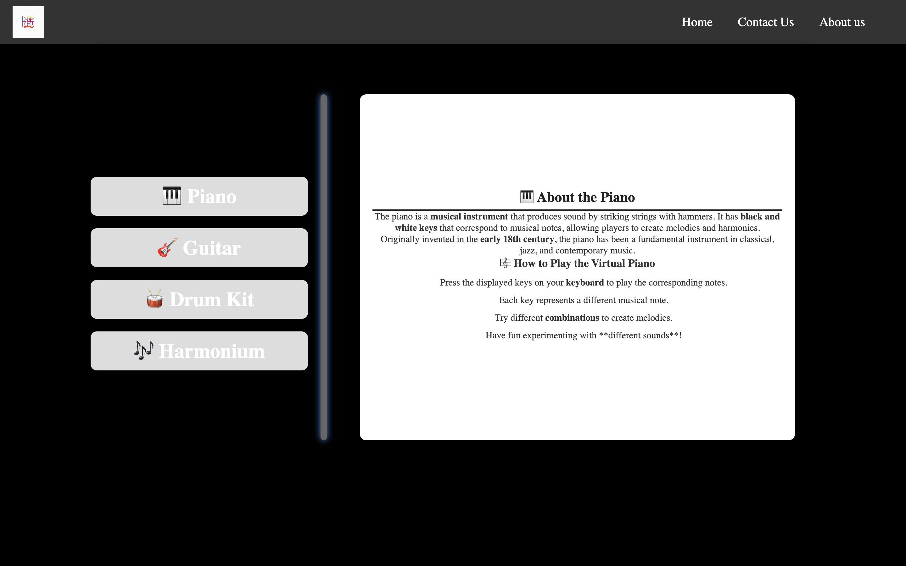
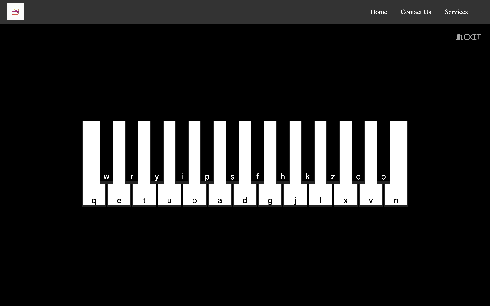
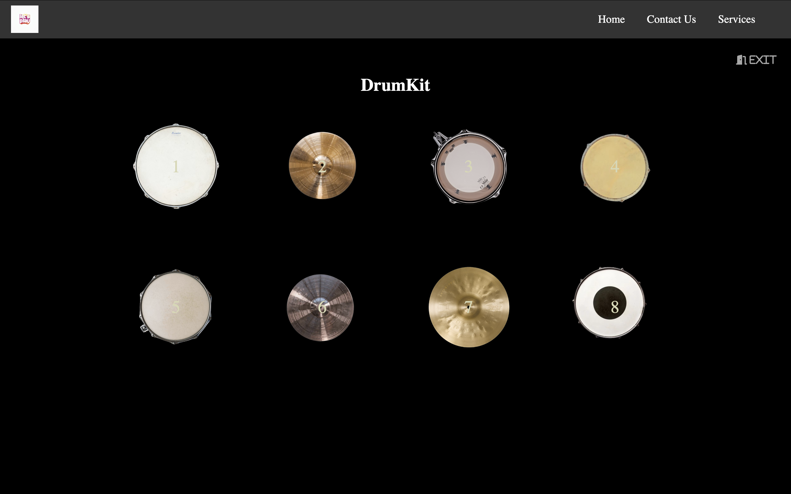
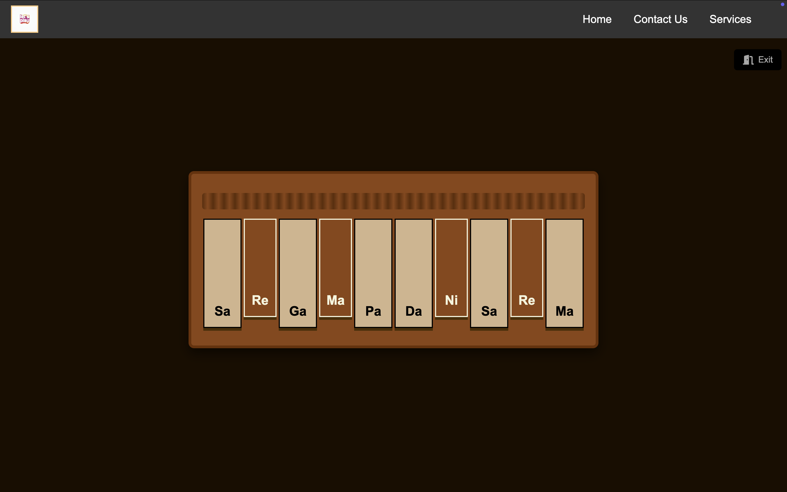
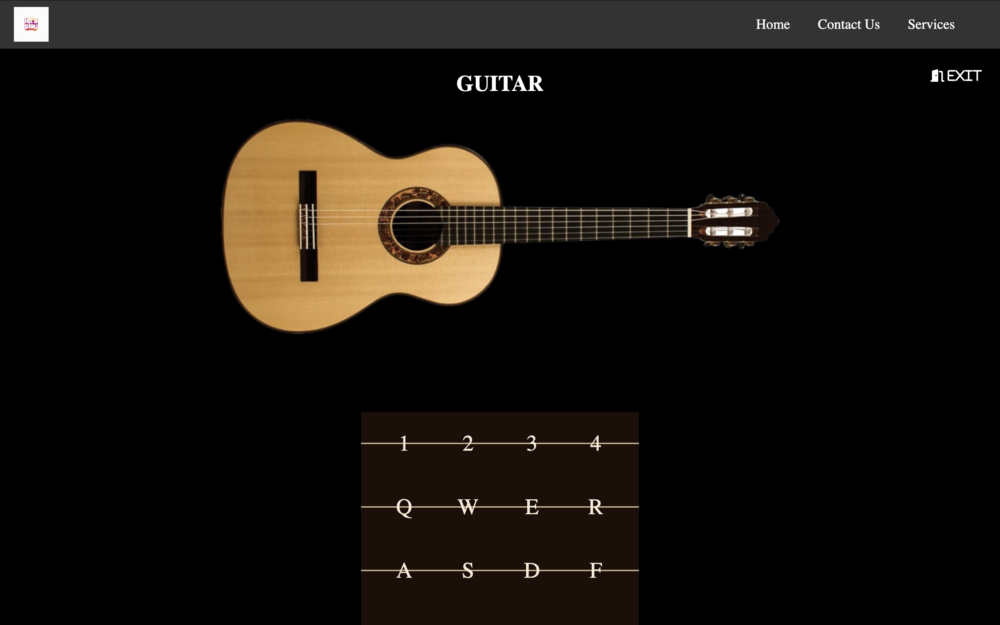

# 🎹 Let's_Play & Wed 🎸🥁🎼

A fun and interactive web application featuring virtual musical instruments like **Piano**, **Guitar**, **Drum Kit**, and **Harmonium**. Built with passion, creativity, and collaboration by four contributors.

---

## 🚀 Features

- 🎹 **Virtual Piano** – Real-time key press, sound, and visual effects  
- 🥁 **Drum Kit** – Playable drum set with responsive sounds and animations  
- 🎸 **Guitar** – Strumming interaction with realistic styling  
- 🎼 **Harmonium** – Classical Indian instrument simulation with mapped keys  
- 💻 **Responsive Design** – Optimized for desktop, tablet, and mobile  
- 🎨 **Custom Styling** – Unique design elements for each instrument  

---

## 🛠️ Tech Stack

- HTML5  
- CSS3  
- JavaScript (Vanilla JS)  
- Sound libraries or custom audio assets

---

## 👥 Contributors

### 🧠 Sourabh Sarkar *(Main Contributor)*  
- Designed the **Home Page**  
- Developed the **Virtual Piano**  
- Managed and organized the entire project  
- Helped other team members with **UI/UX styling**

### 🥁 Ravi Yadav  
- Built the **Virtual Drum Kit**  
- Worked on **responsive layouts**  
- Added **animations and sound effects**  
- Assisted with **bug fixing** and UI polishing

### 🎸 Nilkil  
- Created the **Virtual Guitar**  
- Developed **string interaction logic**  
- Styled the guitar with a **realistic look**

### 🎼 Abhijeet  
- Developed the **Virtual Harmonium**  
- Mapped keys and integrated **sound playback**  
- Worked on **layout and usability**

---

## 📸 Screenshots
### Home Page


### 🎹 Piano


### 🥁 Drum Kit


### 🎼 Harmonium


### 🎸 Guitar


---

## 📁 Project Structure
lets_play/ ├── audio/ # Audio files for instruments │ ├── drumkit/ │ ├── guiter/ │ ├── harmonium/ │ └── piano/ │ ├── instruments/ # Instrument-specific components │ ├── DrumKit/ │ ├── Guiter/ │ ├── Harmonium/ │ └── Piano/ │ ├── index.html │ ├── script.js │ └── style.css │ ├── public/ # Public assets (optional usage) │ ├── index.html # Main entry point ├── script.js # Global JavaScript ├── style.css # Global Styles ├── README.md # Project Documentation └── package-lock.json
---

## 🧩 How to Run

1. Clone this repository:
   ```bash
   git clone https://github.com/sourabh14022004/Let-s-Play2.git

2. Open index.html in your browser

3. Play and enjoy the music! 🎶

## 🧩 Technologies Used
- HTML5
- CSS3
- JavaScript (Vanilla)

## 📬 Feedback
Have suggestions or want to contribute? Feel free to open an issue or a pull request.


## 📄 License
This project is open-source and available under the MIT License.

- “Where words fail, music speaks.” – Hans Christian Andersen


---

# Let me know if you want to:

- Add badges (e.g., GitHub stars, forks, license, etc.)
- Include deployment info (e.g., if it's live on Vercel or Netlify)
- Customize theme colors or styles for the instruments
- Auto-generate instrument keys using JS instead of hardcoding

I can help with all of that too!
